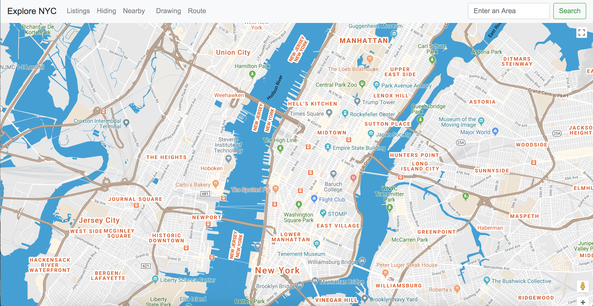
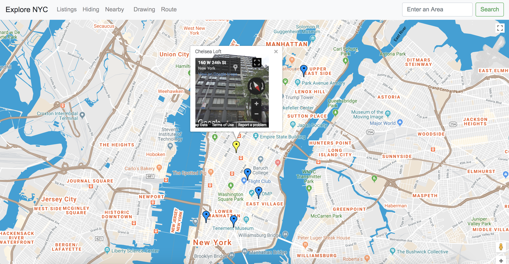
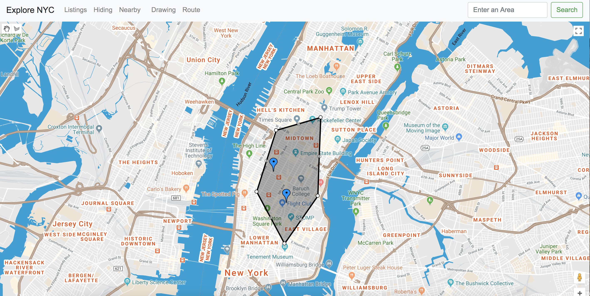

# Explore-City-Map

## About
This is a city explore website that using Google Map APIs and users are able to zoom into their favorite area in NYC, draw the area that they want to explore, find the routs to a specific place and explore nearby places.

## Skills 
- Javascript
- HTML
- CSS
- Bootstrap
- Knockout

## Functions

Homepage

With Login

Show listings spots

Draw an area

Show nearby places

Show routs

